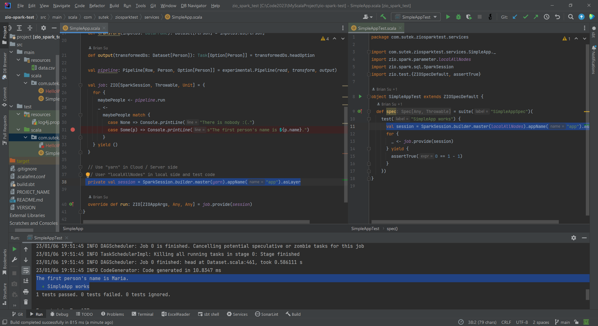
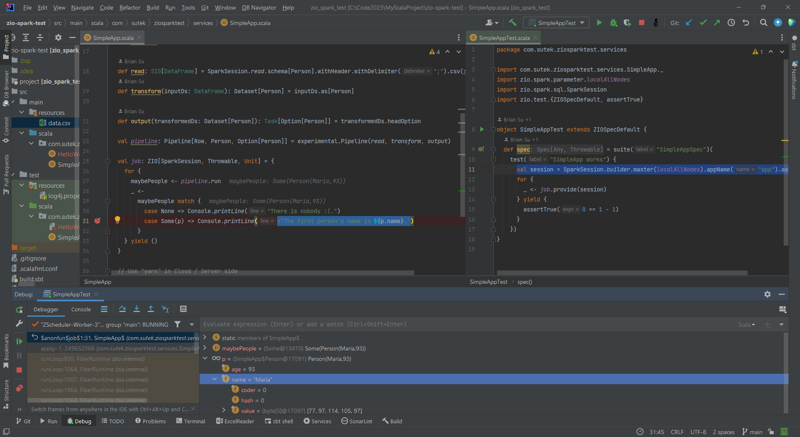

# MyScalaProject

ZIO and ZIO Test

## zio-spark-test

The main code `SimpleApp.scala` runs on the Cloud / server side.

`private val session = SparkSession.builder.master(yarn).appName("app").asLayer`

It wouldn't work in local with `yarn`.

It will work in local if we change from `yarn` to `localAllNodes`.

With ZIO Test, the test code `SimpleAppTest.scala` will test the main code logic in local with `localAllNodes`.

If I debug the `SimpleAppTest.scala`, it will stop at the breakpoint of `SimpleApp.scala` - which is expected!

